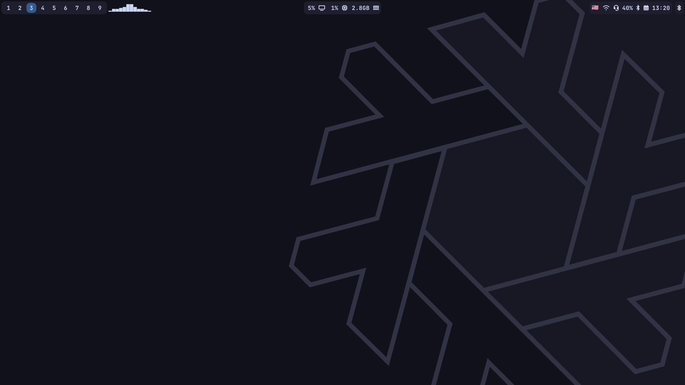

# NixOS Configuration 

This is my NixOs configuration. I'm a newbie so don't judge me too harshly.

## Features

- 🪟 **Hyprland + waybar**
- 🗿 **Gnome with extensions**
- 🎨 **Catppuccin-mocha theme**
- 🐟 **Fish terminal**

## Installation

To get started with this setup, follow these steps:

1. **Install NixOS**: If you haven't already installed NixOS, follow the [NixOS Installation Guide](https://nixos.org/manual/nixos/stable/#sec-installation) for detailed instructions.

2. **Clone the Repository**:

   ```bash
   git clone https://github.com/BitterLemon-git/nixos-config
   cd nixos-config
   ```

3. **Put your `hardware-configuration.nix` file there**:

   ```bash
   cp /etc/nixos/hardware-configuration.nix ./
   ```

4. **Rebuilding**:

   ```bash
   git add .
   nixos-rebuild switch --flake ./
   ```

### ⚠️ Warning
1. **When you log out via wlogout, the waybar will not be displayed when you log back into hyprland. To solve this problem, I added a bind to launch the waybar "Super + Shift + W"**
2. **Waybar shows nvidia gpu usage, so if you have other gpu, you should change the waybar settings**

## 📸 Screenshots

### Hyprland


### Gnome


### Grub
