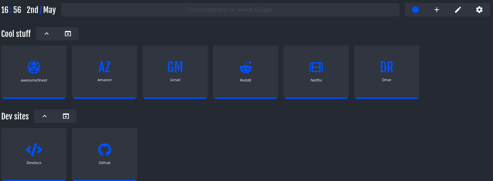
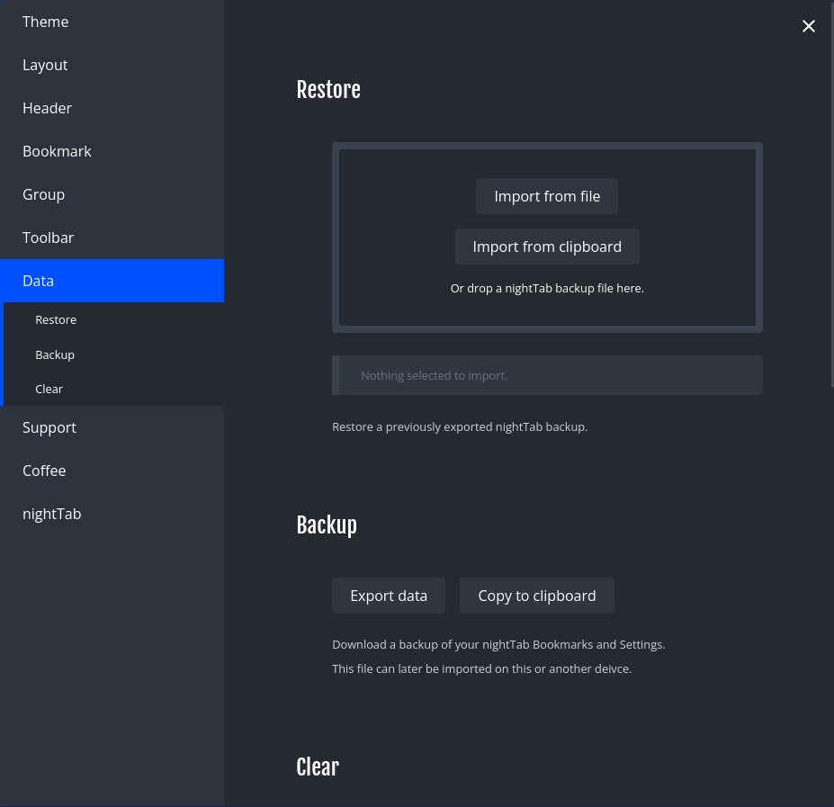

# How to set up firefox theme

1. **Download the "nightTab extension and open the new tab"**

2. **Open settings menu, choose data and import data from file**

3. **Choose the json file for theme**